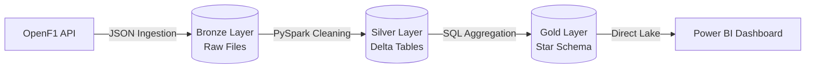

# 🏎️ Formula 1 End-to-End Data Pipeline


## 📖 Project Overview
This personal project aims to build a complete **End-to-End Data Pipeline** using **Microsoft Fabric**. The system ingests historical and real-time Formula 1 data, processes it following the Medallion Architecture (Bronze, Silver, Gold), and serves it for analytical reporting.

The main goal is to apply **DP-600 (Fabric Analytics Engineer)** certification concepts in a real-world scenario.

## 🏗️ Architecture (Medallion)
The data flows from the API through a structured Lakehouse architecture:



A: Bronze (Raw): Landing zone for raw JSON data from the API.

B: Silver (Cleaned): Data is deduplicated, typed, and stored as Delta Parquet tables.

C: Gold (Curated): Business-level aggregations and Dimensional Modeling (Star Schema).

## 🛠️ Tech Stack
**Cloud Platform:** Microsoft Fabric (Data Engineering & Data Warehouse).

**Storage:** OneLake (ADLS Gen2).

**Compute:** Spark Pools (PySpark) & T-SQL.

**Orchestration:** Fabric Data Factory Pipelines.

**Source:** OpenF1 API.

## 🚀 Roadmap & Progress
[x] Environment Setup (Fabric + GitHub).

[ ] Bronze Layer Ingestion (Drivers, Constructors, Circuits).

[ ] Silver Layer Transformation (Data Cleaning).

[ ] Gold Layer Modeling (Dimensions & Facts).

[ ] Final Dashboard in Power BI.

## 💻 How to Run
This project is designed to run inside a Microsoft Fabric Workspace.

1. Create a Fabric Workspace.

2. Connect the Workspace to this GitHub repository via "Workspace Settings > Git Integration".

3. Sync the repository to import the Notebooks.

4. Run the notebooks in numerical order (01 -> 02 -> 03).

## 📂 Project Structure
The repository is organized to separate logic, data, and configuration:
```text
f1-fabric-proyect/
│
├── 📂 notebooks/          # Fabric Notebooks (PySpark/SQL)
│   ├── 01_ingestion/     # API -> Bronze (Raw JSON)
│   ├── 02_transform/     # Bronze -> Silver (Delta Tables)
│   └── 03_analysis/      # Silver -> Gold (Aggregations)
│
├── 📂 src/                # Reusable Python modules/functions
├── 📂 data/               # Sample data (excluded from git via .gitignore)
├── .gitignore            # Security configuration
└── README.md             # Project Documentation
