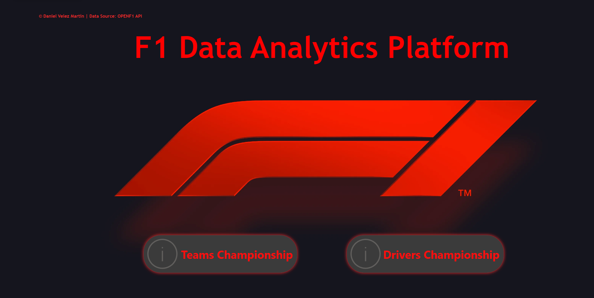
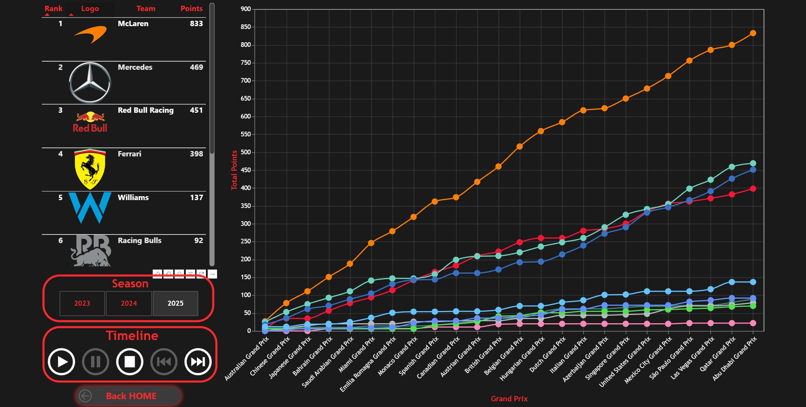
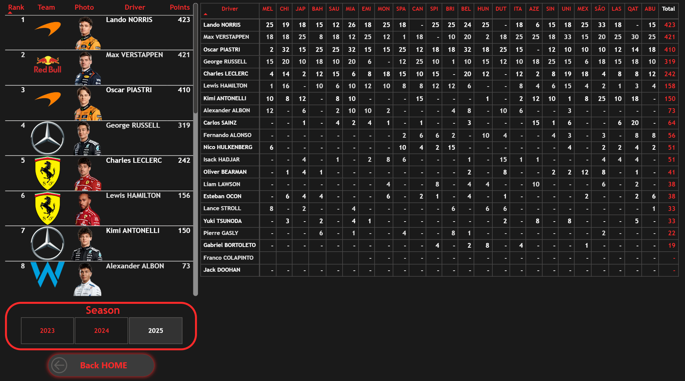
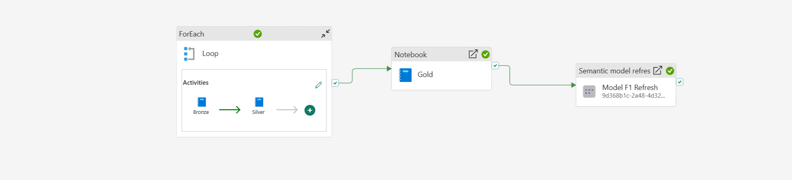
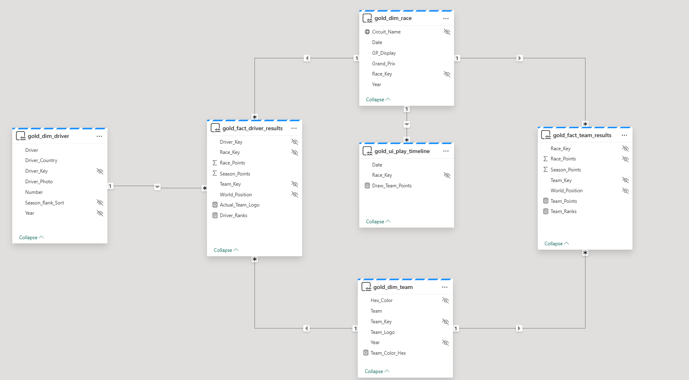

# F1 Data Analytics Platform | Microsoft Fabric End-to-End

<div align="center">

<a href="https://www.microsoft.com/en-us/microsoft-fabric" target="_blank"></a>&nbsp;<a href="https://learn.microsoft.com/en-us/azure/storage/blobs/data-lake-storage-introduction" target="_blank"></a>&nbsp;<a href="https://spark.apache.org/" target="_blank"></a>&nbsp;<a href="https://www.python.org/" target="_blank"></a>&nbsp;<a href="https://delta.io/" target="_blank"></a>&nbsp;<a href="https://openf1.org/" target="_blank"></a>

</div>


<table style="width: 100%; border-collapse: collapse; border: none;">
  <tr style="border: none;">
    <td style="width: 50%; border: none; padding: 5px;">
      
      <p align="center"><b>Teams Dashboard</b></p>
    </td>
    <td style="width: 50%; border: none; padding: 5px;">
      
      <p align="center"><b>Drivers Dashboard</b></p>
    </td>
  </tr>
</table>


## Project Overview
This personal project aims to build a complete **End-to-End Data Pipeline** using **Microsoft Fabric**. The system ingests historical Formula 1 data, processes it following the Medallion Architecture (Bronze, Silver, Gold), and serves it for analytical reporting.

The main goal is to apply **DP-700 (Fabric Data Engineer)** certification concepts in a real-world scenario.

## Architecture (Medallion)
The data flows from the API through a structured Lakehouse architecture:

<div align="center">
  
</div>

* **Bronze (Raw):** Landing zone for raw JSON data from the API.

* **Silver (Cleaned):** Data is deduplicated, typed, and stored as Delta Parquet tables.

* **Gold (Curated):** Business-level aggregations and Dimensional Modeling (Star Schema).

## Tech Stack
* **Cloud Platform:** Microsoft Fabric (Data Engineering & Data Warehouse).

* **Storage:** OneLake (ADLS Gen2).

* **Compute:** Spark Pools (PySpark) & T-SQL.

* **Orchestration:** Fabric Data Factory Pipelines.

* **Source:** OpenF1 API.

## Roadmap & Progress
- [x] **Phase 1: Environment Setup (Fabric + GitHub)**

- [x] **Phase 2: Ingestion (Bronze)**
    - [x] Drivers Data
    - [x] Constructors Data
    - [x] Circuits Data

- [x] **Phase 3: Silver Layer Transformation (Data Cleaning)**
    - [x] Drivers Data
    - [x] Constructors Data
    - [x] Circuits Data
    
- [x] **Phase 4: Gold Layer Modeling (Dimensions & Facts)**
    - [x] Drivers Data
    - [x] Constructors Data
    - [x] Circuits Data

- [x] **Phase 5: Final Dashboard in Power BI**
    - [x] Driver Championship Data
    - [x] Constructor Championship Data
     
---

## Deep Dive: Architecture & Business Logic

### 1. Ingestion & Orchestration (The Pipeline)
The workflow begins with the total automation of the data lifecycle. This is not just a collection of scripts; it is a resilient process orchestrated natively within **Microsoft Fabric**.

* **Data Factory Orchestration:** A master pipeline manages dependencies, ensuring the **Silver** process only triggers if **Bronze** succeeds, maintaining referential integrity from the start.
* **API Limit Handling:** The ingestion layer is built to handle paginated requests and respect rate limits from the OpenF1 API, preventing data loss or connection blocks.



* **Dynamic Parameterization (Variables & Parameters):** To achieve full automation and multi-season support, I implemented a **Parameter-Driven Architecture**. 
    * **Automated Yearly Ingestion:** Instead of hard-coding values, the pipeline uses **Pipeline Variables** to store the `Year`. 
    * **Runtime Injection:** These variables are passed as parameters to the Notebook activities at runtime. This allows the system to dynamically adjust API endpoints and folder paths (e.g., `Files/Bronze/2024/`) without manual intervention.
    * **Scalability:** By simply changing a single pipeline-level parameter, the entire Medallion flow can be re-run for any F1 season, making the project a reusable framework rather than a static analysis.

---

### 2. Silver Layer: Data Quality & "Edge Cases"
This is where the engineering value shines. F1 data is notoriously chaotic—drivers switch teams, races get cancelled, and teams undergo rebranding.

####  Team-Switch Proof (Mid-Season Transfers)
* **The Problem:** A driver (e.g., Ricciardo/Lawson in 2023) can change teams mid-year. A simple JOIN on `Driver_Key` would duplicate records or lose historical context.
* **The Solution:** I implemented a **Dynamic Normalization** logic. Results are bound to a unique combination of `Race_Key` + `Driver_Key` + `Team_Key`. This ensures a driver's history remains intact regardless of the colors they wore in a specific Grand Prix.

####  Custom Data Enrichment
* **The Problem:** The OpenF1 API occasionally lacks standardized short codes for Grand Prix names, which are essential for clean visualizations and axis labels.
* **The Solution:** I engineered a custom mapping logic to generate consistent **3-letter Alpha Codes** (e.g., `MON` for Monaco, `SPA` for Spain). 
* **Impact:** This enrichment ensures that drivers charts remain visually consistent and readable, regardless of the raw naming conventions provided by the source API.

#### UX/UI Data
* **The Problem:** The source API occasionally returns `NULL` or broken URLs for driver headshots, particularly for rookies or mid-season substitutes (e.g., Bearman, Lawson).
* **The Solution:** The script detects missing assets and automatically injects a hosted "Generic Silhouette" URL.
* **Impact:** This ensures a polished user interface in Power BI, preventing "broken image" icons and maintaining visual consistency across all driver profiles.

#### Data Availability & Scope
* **The Constraint:** The **OpenF1 API** provides telemetry (gap analysis, sector times, positioning) primarily for recent seasons. Historical data prior to 2023 lacks the granularity required for the advanced visualizations in this report.
* **The Strategy:** To ensure data consistency and dashboard reliability, I scoped the ingestion pipeline to the **2023-2025 era**.
* **Scalability Note:** The architecture itself is **year-agnostic**. If the API expands its historical coverage in the future, the pipeline can ingest those seasons simply by updating the `Year` parameter, without code changes.

####  Data Cleansing & Deduplication
* Leveraging **PySpark** `dropDuplicates()` functions based on sensor timestamps to ensure the Silver layer only stores a "Single Source of Truth," even if the source API sends redundant telemetry.

---

### 3. Gold Layer: Star Schema Modeling
The semantic model is optimized for **Direct Lake** mode, eliminating the need for manual refreshes and providing sub-second performance directly over OneLake.

* **Fact Tables:** Store granular metrics such as race positions, points, and lap times.
* **Dimension Tables:** Descriptive attributes for drivers, teams, circuits, and the racing calendar.
* **Relationships:** Protected 1:N relationships prevent ambiguity; filtering by a Team correctly displays every driver who has competed for that constructor.




---

### 4. Advanced DAX: The "Memory Effect"
For a professional-grade dashboard, trend lines must remain continuous even if a team lacks data for a specific GP or a race is cancelled.

```dax
-- Logic for Team Ranking Persistence (Forward Fill)
Team_Ranks = 
CALCULATE(
    LASTNONBLANKVALUE(
        gold_dim_race[Date],
        MAX(gold_fact_team_results[World_Position])
    ),
    REMOVEFILTERS(gold_dim_race),
    gold_dim_race[Date] <= MAX(gold_dim_race[Date]),
    VALUES(gold_dim_race[Year]) -- Prevents historical team overlap
)
```
---

### 5. Visualization & UX (User Experience)
The report is designed for high-level competitive analysis, moving beyond simple data tables.

#### Deneb & Vega-Lite:
* Implementation of custom visuals to display time densities and dynamic rankings.

#### Dynamic Data Styling
* **The Limitation:** Native Power BI charts often assign random colors to categorical data, requiring manual maintenance every time a team rebrands or a new season starts.
* **The Solution:** By using **Deneb (Vega-Lite)**, I bypassed the native color palette restrictions. I created a binding function that reads the specific **Hex Color Code** (ingested in the Silver layer) for each team and applies it directly to the visual marks.
* **Impact:** "Ferrari Red" or "Aston Martin Green" is rendered dynamically based on the data context. This guarantees **Brand Consistency** across historical analysis.

####  Interactive Season Timeline
* To provide a truly immersive experience, I implemented a **Dynamic Timeline** that allows you to "replay" the season.


* **Temporal Storytelling:** The timeline doesn't just filter data; it recalculates the entire state of the championship at any given point in time.

#### Driver Championship Standings
* **Multi-Season & Round-by-Round Navigation:** Users can slice data by specific seasons or replay the championship race-by-race.
* The view below provides a deep dive into individual performance, tracking the evolution of the title race with a focus on consistency and head-to-head metrics.


---

## Future Enhancements

To further evolve this platform from a descriptive dashboard to a predictive analytics tool, the following features are planned:

* **Real-Time Telemetry Integration:** Incorporating live signal data (speed, throttle, brake) using **Fabric Real-Time Intelligence** to analyze driver performance during live sessions.
* **Predictive Modeling:** Implementing **Synapse ML** to predict pit stop windows and race finishing positions based on historical degradation and weather variables.
* **Advanced Tyre Strategy Analysis:** Developing a dedicated Gold layer table to track stint lengths and compound performance for more granular strategy insights.

---

### Quick Deployment Guide

To replicate this Formula 1 data project in your own Microsoft Fabric environment, follow these sequential steps:

#### Step 1: Source Code Synchronization
**Why do we start by synchronizing the main branch and the deployment folder?** This ensures that the target environment only imports the stable version and production ready scripts.
1. Open your Fabric Workspace and navigate to the Git integration settings.
2. Connect this repository, select the `main` branch, and sync the `deployment/` folder.

#### Step 2: Orchestrator Preparation (Data Pipeline)
**What do we achieve by downloading this ZIP file first?** Fabric data pipelines contain very specific internal IDs that block direct synchronization via Git if they don't match the destination workspace. Downloading it allows us to import it manually later.
1. Go to the file view in your repository (or via the Fabric interface).
2. Download the `data_pipe.zip` file to your local machine.

#### Step 3: Lakehouse Binding in Notebooks
**Why is it vital to change the Data Source?** When cloning the project into a new Workspace, the notebooks "lose" the physical path to the data. We need to tell them exactly where to read and write.
1. Open each of the imported Notebooks.
2. In the "Explorer" side panel select f1_lh Lakehouse.

#### Step 4: Semantic Model Configuration (Master Setup)
**What is the purpose of executing this master notebook?** Instead of manually creating and reconnecting the Power BI model, this Python script automates the "Direct Lake" connection between your local data and the semantic model, repairing any links broken during the Git import.
1. Open the `00_Master_Setup` notebook.
2. Run all cells. You will see console messages indicating that the model has successfully synchronized with your Lakehouse.

#### Step 5: Pipeline Import and wiring
**How do we connect all the automated pieces together?** By importing the ZIP file and updating its sources so the orchestrator knows exactly which notebooks to execute in this new workspace.
1. In your Workspace, click on **New > Data Pipeline**.
2. In the top menu, use the **Import pipeline** option and upload your `data_pipe.zip`.
3. The system will prompt you to create a connection for the "Semantic Model Refresh" step. Authorize it with your credentials.
4. Select each activity box in the pipeline and, in the "Settings" tab, make sure to select the correct notebooks from your Workspace.

#### Step 6: Final Execution and Visualization
**What is the final result of all this infrastructure?** Watching the data flow seamlessly from the API all the way to the report in a fully automated manner.
1. Click **Run** on the Data Pipeline and wait for all activities to finish successfully.
2. Once finished, open the visual report. The data will now be ingested, transformed, and ready for analysis!

---


## 📂 Project Structure
```text
f1-fabric-proyect/
│
├── 📂 assets/                  # Static resources for UI & Documentation
│   ├── 📂 teams/               # Team logos and assets for Power BI
│   └── 📂 screenshots/         # Images used in this README
├── 📂 src/                     # Source Code (Fabric Notebooks & ETL)
├── .gitignore 
├── LICENSE                     # Git configuration
└── README.md                   # Project Documentation
